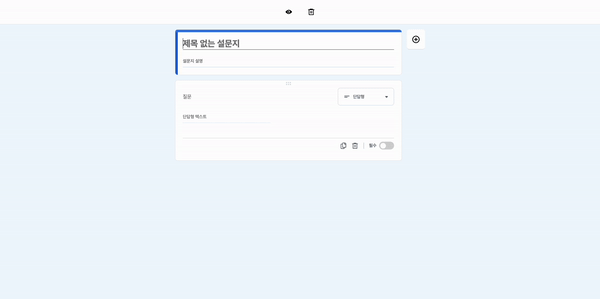
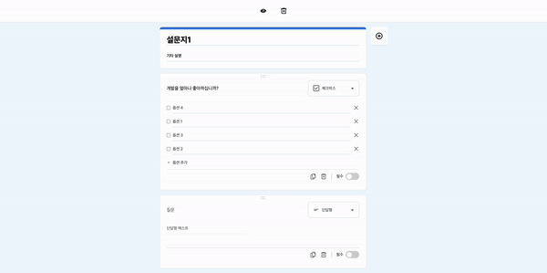
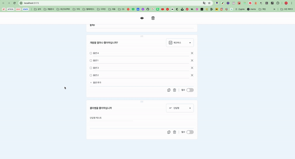
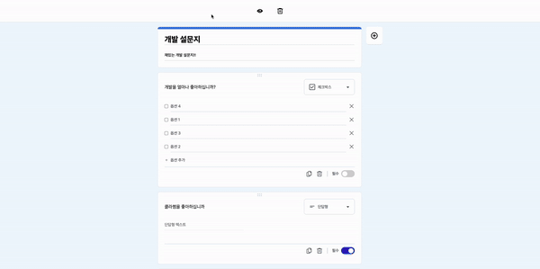

## Google Form Survey

## 구현 사항

모두 구현 완료

- [x] 설문지 제목 편집
- [x] 설문지 설명 편집
- [x] 질문을 추가하면 질문이 추가됩니다.
  - [x] 단답형
  - [x] 장문형
  - [x] 객관식 질문
  - [x] 체크박스
  - [x] 드롭다운
- [x] 질문 복사 기능
- [x] 질문 삭제 기능
- [x] 필수 옵션 설정 기능
- [x] **미리 보기** 기능에서 해당 설문지를 미리볼 수 있어야 합니다!
- [x] [제출] 버튼 눌렀을 경우 사용자가 작성한 데이터를 보여 줍니다. (보여지는 형식은 자유 형식)
- [x] 양식 지우기 (**추가 과제, 가산점**)

<br>

## 추가 구현 사항

- [x] 질문 데이터 저장 (브라우저 새로고침 시 유지)
- [x] 사용자 친화적인 UI/UX
- [x] 렌더링 성능 최적화

<br>

## 실행 방법

```shell
npm i
npm run dev
```

<br>

## 사용 라이브러리

- redux-toolkit (전역상태 관리)
- react-icons (아이콘 라이브러리)
- lodash (debounce 사용)
- styled-components (CSS 라이브러리)
- hello-pangea/dnd (dnd 라이브러리)

<br>

## 간단 기능 소개

### 1. 제목 편집 & 설명 편집 & 옵션 편집 & 카테고리 전환

- 질문, 설명, 옵션을 편집하거나 드래그 앤 드롭으로 전환할 수 있습니다.



<br>
<br>

### 2. 질문 복사 & 삭제

- 질문을 복사하거나 삭제할 수 있습니다.



<br>
<br>

### 3. 필수 옵션

- 필수 옵션은 새로고침을 해도 유지됩니다.



<br>
<br>

### 4. 미리보기 및 제출

- 헤더의 미리보기 버튼을 누르면 새 창으로 응답을 할 수 있는 미리보기 창이 표출됩니다.
- 미리보기 모드의 제출하기를 누르면 사용자 응답 값을 확인할 수 있습니다.



<br>
<br>

### 5. 양식 지우기

- 헤더의 전체 삭제 버튼을 누르면 모두 삭제됩니다.

<br>
<br>

## 추가 구현 사항 설명

### 1. 질문 데이터 저장 (브라우저 새로고침 시 유지)

- localStorage에 전체 질문 데이터를 객체화하여 stringify하여 저장합니다.
- redux-toolkit의 초기화 값을 localStorage에서 조회하여 지정합니다. (저장된 값이 없으면 지정된 초기값으로 지정합니다.)
- store의 subscribe기능으로 질문 데이터가 바뀔 때마다 localStorage에 저장합니다.

```javascript

// questionSlice.ts
// fallback용 초기값
const initialState: InitialState = {
  value: [
    {
      id: Date.now(),
      title: "",
      category: "단답형",
      options: ["옵션 1"],
      required: false,
    },
  ],
};

// 로컬 스토리지의 저장값을 불러오는 콜백 함수
const loadStateFromLocalStorage = () => {
  try {
    const serializedState = localStorage.getItem("form-questions");
    if (serializedState === null) return initialState;

    const parsed = JSON.parse(serializedState);
    return parsed.question;
  } catch (err) {
    return initialState;
  }
};

const questionSlice = createSlice({
  name: "question",
  // 콜백 함수 실행 or fallback으로 설정
  initialState: loadStateFromLocalStorage() || initialState,
  ...
```

```javascript
// store.js
// 유틸 함수로 사용자 응답들을 받아서 localStorage에 지속적으로 저장합니다.
store.subscribe(() => {
  saveStateToLocalStorage(store.getState());
});
```

### 2. 사용자 친화적인 UI/UX

- 특정 질문 항목을 편집할 때 좌측 파란색 라벨이 표출됩니다.
- hover시 편집 가능한 항목들에 대한 피드백들이 있습니다.
- 기기 사이즈가 768px보다 작을 시 여유 공간을 위해 '질문 추가 버튼'이 collapse되어 헤더 영역에 포함됩니다.
